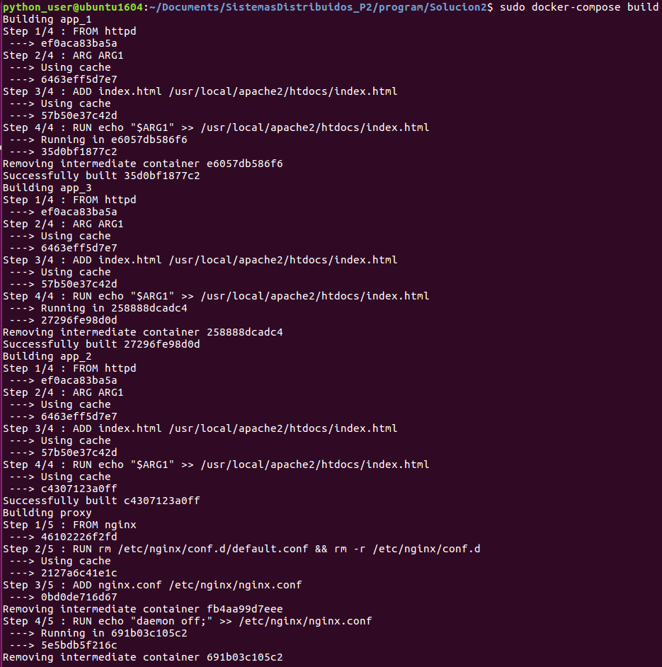
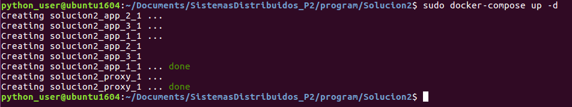
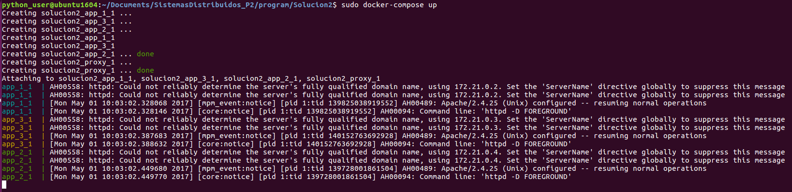
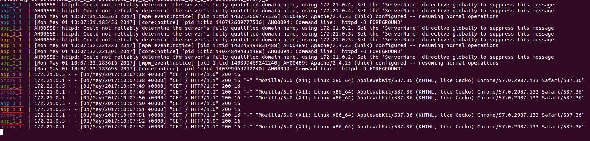
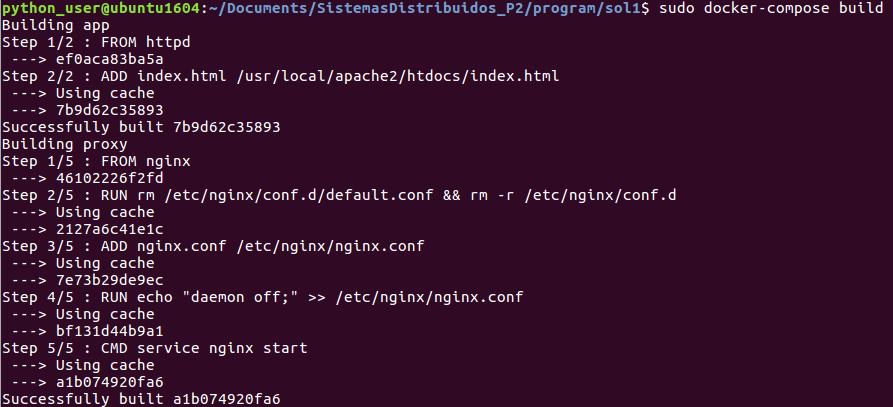
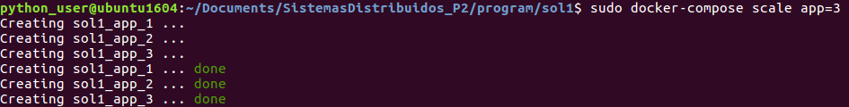
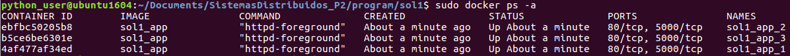
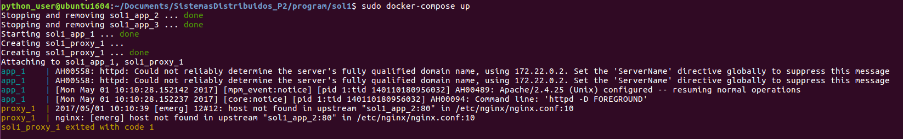

# SistemasDistribuidos_P2

#### Nombre Estudiante: Andrés Felipe Piñeros
#### Código Estudiante: A00273344
#### Repositorio: https://github.com/AndresPineros/SistemasDistribuidos_P2

### Descripción
Aprovisionamiento	de	un	ambiente	compuesto	por	los	siguientes	elementos:	un servidor	encargado de	realizar balanceo de	carga,	tres	servidores	web	con páginas estáticas. Se	debe probar	el	funcionamiento	del balanceador	realizando peticiones y mostrando servidores distintos atendiendo las peticiones.

<p align="center">
  
</p>

### Actividades
En un documento en formato PDF cuyo nombre de
archivo debe ser examen2_codigoestudiante.pdf debe incluir lo siguiente:

1. Documento en formato PDF:  
  * Formato PDF (5%)
  * Nombre y código de los integrantes del grupo (5%)
  * Ortografía y redacción (5%)
2. Consigne los comandos de linux necesarios para el aprovisionamiento de los servicios solicitados. En este punto no debe incluir archivos tipo Dockerfile solo se requiere que usted identifique los comandos o acciones que debe automatizar (15%)
3. Escriba los archivos Dockerfile para cada uno de los servicios solicitados junto con los archivos fuente necesarios. Tenga en cuenta consultar buenas prácticas para la elaboración de archivos Dockerfile. (20%)
4. Escriba el archivo docker-compose.yml necesario para el despliegue de la infraestructura (10%)
5. Publicar en un repositorio de github los archivos para el aprovisionamiento junto con un archivo de extensión .md donde explique brevemente como realizar el aprovisionamiento (15%)
6. Incluya evidencias que muestran el funcionamiento de lo solicitado (15%)
7. Documente algunos de los problemas encontrados y las acciones efectuadas para su solución al aprovisionar la infraestructura y aplicaciones (10%)


## 1. Acciones y Comandos de Linux para el Aprovisionamiento de las Máquinas

### 1.1 Load Balancer

La máquina de balanceo de cargas se encargará de recibir las peticiones por el puerto 8080 y de redireccionar dichas peticiones (equitativamente) hacia las máquinas web. Para esto se usará el servicio de balanceo de cargas de Nginx.

Las acciones a realizar para configurar efectivamente el balanceador de cargas son:
- Abrir el puerto 8080 con el servicio de iptables.

``` sh
iptables -I INPUT 5 -p tcp -m state --state NEW -m tcp --dport 8080 -j ACCEPT
service iptables save
```

- Instalar Nginx

``` sh
apt-get update nginx
apt-get install nginx -y
```
- Configurar el archivo de Nginx para balancear las cargas (`/etc/nginx/nginx.conf`)

Actualmente el archivo tiene contenido. Este se debe reemplazar completamente por la siguiente configuración:

``` sh
worker_processes 4;
 
events { worker_connections 1024; }
 
http {
    sendfile on;
 
    upstream app_servers {
        server app_1:80;
        server app_2:80;
        server app_3:80;
    }
 
    server {
        listen 80;
 
        location / {
            proxy_pass         http://app_servers;
            proxy_redirect     off;
            proxy_set_header   Host $host;
            proxy_set_header   X-Real-IP $remote_addr;
            proxy_set_header   X-Forwarded-For $proxy_add_x_forwarded_for;
            proxy_set_header   X-Forwarded-Host $server_name;
        }
    }
}
```
En este archivo se definen los servidores a los que el balanceador de carga apuntará. También se define el puerto de escucha del balanceador de cargas. En este caso, ya que el puerto 80 se encuentra actualmente en uso, se usará el puerto 8080.

- Reiniciar servicio de Nginx

``` sh
service nginx restart
```

### 1.2 Máquinas Web

- Instalar dependencias de tecnologías
``` sh
apt-get install httpd -y
```
- Abrir puerto 80 para recibir peticiones http
``` sh
iptables -I INPUT 5 -p tcp -m state --state NEW -m tcp --dport 80 -j ACCEPT
service iptables save
```
- Agregar el archivo de index que se entregara por el puerto 80


# 2. Soluciones
Realizar templates en Docker no es tan sencillo como en Vagrant. También es complicado simular estrategias para realizar templates sin romper las buenas prácticas de Docker. Por ejemplo, si se usan variables del entorno del contenedor para posteriormente modificar los archivos con el comando sed (simulando templates), tocaría ejecutar en el ENTRYPOINT todos los comandos para reemplazar los parámetros por los argumentos de building y además el comando de ejecución del servicio.

### 2.1 Solución base

Para servir la página web utilizaré Apache2 (httpd) ya que tiene una configuración muy básica, aunque es un poco pesado.

Descargamos el contenedor que viene con httpd versión 2.4
```
sudo docker pull httpd:2.4
```
Creamos el archivo Dockerfile para hacer build al nuevo contenedor que contendrá el archivo HTML de la página web.

#### 2.1.1 Contenedores web
```
#Dockerfile del httpd con archivo dinámico
FROM httpd
#Recibe el argumento de build llamado ARG1
ARG ARG1
#Agrega el index.html base al contenedor
ADD index.html /usr/local/apache2/htdocs/index.html
#Modifica el archivo index agregando el argumento al final
RUN echo "$ARG1" >> /usr/local/apache2/htdocs/index.html
```

El archivo de index.html es muy básico:
```
Hell yeah!
```

#### 2.1.2 Contenedor proxy

```
#Se usa el contenedor con nginx pre instalado
FROM nginx
#Se elimina el archivo de configuración default y su carpeta
RUN rm /etc/nginx/conf.d/default.conf && rm -r /etc/nginx/conf.d
#Se agrega el archivo de configuracion de nginx
ADD nginx.conf /etc/nginx/nginx.conf
#Se agrega esta linea para que el contenedor no termine su ejecucion.
RUN echo "daemon off;" >> /etc/nginx/nginx.conf
CMD service nginx start
```
El archivo de configuración de Nginx que se agrega es el siguiente.
Se hace referencia a las aplicaciones por medio de los links del compose.
En el upstream se agrega el puerto 80 de los contenedores web ya que el servicio es el httpd, que por default se expone en el puerto 80.
```
worker_processes 4;
 
events { worker_connections 1024; }
 
http {
    sendfile on;
 
    upstream app_servers {
        server app_1:80;
        server app_2:80;
        server app_3:80;
    }
 
    server {
        listen 80;
 
        location / {
            proxy_pass         http://app_servers;
            proxy_redirect     off;
            proxy_set_header   Host $host;
            proxy_set_header   X-Real-IP $remote_addr;
            proxy_set_header   X-Forwarded-For $proxy_add_x_forwarded_for;
            proxy_set_header   X-Forwarded-Host $server_name;
        }
    }
}
```
#### 2.1.3 Compose
En el compose se exponen los servicios de las tres aplicaciones. No me agrada tener que repetir el servicio por cada contenedor pues no es muy escalable. En todo caso, los servidores web exponen el puerto 80 del servicio HTTPD. Al exponerlos, únicamente otros contenedores del daemon de Docker podrán accederlo. Se parametrizan las diferencias de la página web por medio de la opción de args del build de la versión 3 del docker-compose.

Al final del archivo se crea el servicio de reverse-proxy de Nginx. Lo especial de este servicio es que para poder exponer el balanceo de cargas se hace el binding del puerto 80 de Nginx al puerto 8080 de la máquina host. También que se hace un link hacia las aplicaciones web. Por este link es que en el archivo de configuración de Nginx se puede hacer referencia a las IP's de los contenedores web por medio de su nombre.
```
version: '3'
 
services:
  app_1:
    build:
      context:  ./app
      dockerfile: Dockerfile
      args:
        - ARG1=App1
    expose:
      - "80"

  app_2:
    build:
      context:  ./app
      dockerfile: Dockerfile
      args:
        - ARG1=App2
    expose:
      - "80"

  app_3:
    build:
      context:  ./app
      dockerfile: Dockerfile
      args:
        - ARG1=App3
    expose:
      - "80"

  proxy:
    build:
      context:  ./nginx
      dockerfile: Dockerfile
    ports:
      - "8080:80"
    links:
      - app_1
      - app_2
      - app_3
```
Ahora que se han creado los archivos es posible iniciar los servicios de los contenedores con los siguientes comandos:

Personalmente me gusta dejar la opción de no cache mientras verifico que el sistema funciona correctamente. Cuando todo corre correctamente, quito el flag --no-cache para que el proceso de build sea más veloz.
```
sudo docker-compose build --no-cache
```
<p align="center">
  
</p>

Idealmente el sistema debería correrse el sistema de forma dettached en un entorno de producción. Se puede ver cómo se crean los contenedores hasta que se encuentran listos para ser usados.
```
sudo docker-compose up -d
```
<p align="center">
  
</p>
Pero para fines ilustrativos lo correré sin el flag -d. En este caso se pueden ver todos los servicios expuestos por el compose, de tal forma que si algún servicio recibe una petición, podremos verlo en consola.
```
sudo docker-compose up
```
<p align="center">
  
</p>

Ahora, el puerto que el contenedor de Nginx expone es el puerto 80, pero en mi máquina HOST ya lo tengo ocupado con otro servicio. Por lo tanto, en el docker-compose.yml se hizo binding de este puerto al 8080. Así con localhost:8080 se podrá acceder al servicio de balanceo de cargas que está apuntando a los servicios web:
<p align="center">
  
</p>
<p align="center">
  
</p>
<p align="center">
  
</p>
Se puede ver que por cada petición se accede al siguiente contenedor web. La razón por la que esto ocurre es que Nginx por default utiliza un algoritmo de balanceo llamado RoundRobin, que no es muy inteligente, pues simplemente distribuye en ciclos las peticiones. Otros algoritmos tienen en cuenta la verdadera carga que cada petición tiene sobre el servidor. Se puede visualizar el RoundRobin en la consola:

<p align="center">
  
</p>

Se ve como el ciclo es app1 -> app2 -> app3 -> app1 -> ...

### 2.2 Otra posible solución

Es posible utilizar docker-compose para realizar una solución más elegante que permite escalar sin necesidad de hacer build a múltiples contenedores web.

En el docker-compose.yml se agregan los tipos de contenedores que se desean una única vez. Esto tiene el problema de que no permitirá que los nodos tengan páginas web diferentes, pero cuando se intenta escalar horizontalmente un servicio, la idea es que todos sean idénticos.

A continuación el nuevo docker-compose.yml:
```
version: '2'
 
services:
  app:
    build:
      context:  ./app
      dockerfile: Dockerfile
    expose:
      - "5000"
 
  proxy:
    build:
      context:  ./nginx
      dockerfile: Dockerfile
    ports:
      - "8080:80"
    links:
      - app

```
La configuración de nginx es la misma, únicamente se modifica el nombre de los contenedores web ya que tendrán como prefijo la carpeta en la que se encuentra el docker-compose.yml. En este caso sol1 al ser la carpeta de la primera solución:
```
worker_processes 4;
 
events { worker_connections 1024; }
 
http {
    sendfile on;
 
    upstream app_servers {
        server sol1_app_1:80;
        server sol1_app_2:80;
            ....
            ....
            ....
```
y la aplicación web simplemente evitaría todo lo relacionado a los args de building.
```
#Dockerfile web del httpd con archivo dinámico
FROM httpd
ADD index.html /usr/local/apache2/htdocs/index.html
```

Se hace build de los contenedores. Esto es particularmente importante ya que no se repetirá la configuración de contenedores web sino que se desplegarán desde una única imagen:
```
sudo docker-compose build
```
<p align="center">
  
</p>
Ahora se escalarán los contenedores web a la cantidad necesaria. En este caso 3:
```
sudo docker-compose scale app=3
```
<p align="center">
  
</p>
Si se realiza un docker ps -a se pueden ver los 3 contenedores web:
<p align="center">
  
</p>
Desafortunadamente parece que hay un bug en docker-compose y al intentar desplegar los servicios, elimina todos los contenedores web que no sean el número1.
<p align="center">
  
</p>
Se puede ver como los primeros pasos de la acción es eliminar los contenedores repetidos por el comando scale. Esta solución, para un entorno real sería mucho más eficiente.
