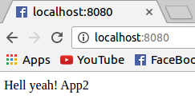

# SistemasDistribuidos_P2

#### Nombre Estudiante: Andrés Felipe Piñeros
#### Código Estudiante: A00273344
#### Repositorio: https://github.com/AndresPineros/SistemasDistribuidos_P2

### Descripción
Aprovisionamiento	de	un	ambiente	compuesto	por	los	siguientes	elementos:	un servidor	encargado de	realizar balanceo de	carga,	tres	servidores	web	con páginas estáticas. Se	debe probar	el	funcionamiento	del balanceador	realizando peticiones y mostrando servidores distintos atendiendo las peticiones.

<p align="center">
  
</p>

### Actividades
En un documento en formato PDF cuyo nombre de
archivo debe ser examen2_codigoestudiante.pdf debe incluir lo siguiente:

1. Documento en formato PDF:  
  * Formato PDF (5%)
  * Nombre y código de los integrantes del grupo (5%)
  * Ortografía y redacción (5%)
2. Consigne los comandos de linux necesarios para el aprovisionamiento de los servicios solicitados. En este punto no debe incluir archivos tipo Dockerfile solo se requiere que usted identifique los comandos o acciones que debe automatizar (15%)
3. Escriba los archivos Dockerfile para cada uno de los servicios solicitados junto con los archivos fuente necesarios. Tenga en cuenta consultar buenas prácticas para la elaboración de archivos Dockerfile. (20%)
4. Escriba el archivo docker-compose.yml necesario para el despliegue de la infraestructura (10%)
5. Publicar en un repositorio de github los archivos para el aprovisionamiento junto con un archivo de extensión .md donde explique brevemente como realizar el aprovisionamiento (15%)
6. Incluya evidencias que muestran el funcionamiento de lo solicitado (15%)
7. Documente algunos de los problemas encontrados y las acciones efectuadas para su solución al aprovisionar la infraestructura y aplicaciones (10%)


## 1. Acciones y Comandos de Linux para el Aprovisionamiento de las Máquinas

### 1.1 Load Balancer

La máquina de balanceo de cargas se encargará de recibir las peticiones por el puerto 8080 y de redireccionar dichas peticiones (equitativamente) hacia las máquinas web. Para esto se usará el servicio de balanceo de cargas de Nginx.

Las acciones a realizar para configurar efectivamente el balanceador de cargas son:
- Abrir el puerto 8080 con el servicio de iptables.

``` sh
iptables -I INPUT 5 -p tcp -m state --state NEW -m tcp --dport 8080 -j ACCEPT
service iptables save
```

- Instalar Nginx

``` sh
apt-get update nginx
apt-get install nginx -y
```
- Configurar el archivo de Nginx para balancear las cargas (`/etc/nginx/nginx.conf`)

Actualmente el archivo tiene contenido. Este se debe reemplazar completamente por la siguiente configuración:

``` sh
worker_processes 4;
 
events { worker_connections 1024; }
 
http {
    sendfile on;
 
    upstream app_servers {
        server app_1:80;
        server app_2:80;
        server app_3:80;
    }
 
    server {
        listen 8080;

        location / {
            proxy_pass         http://app_servers;
            proxy_redirect     off;
            proxy_set_header   Host $host;
            proxy_set_header   X-Real-IP $remote_addr;
            proxy_set_header   X-Forwarded-For $proxy_add_x_forwarded_for;
            proxy_set_header   X-Forwarded-Host $server_name;
        }
    }
}
```
En este archivo se definen los servidores a los que el balanceador de carga apuntará. También se define el puerto de escucha del balanceador de cargas. En este caso, ya que el puerto 80 se encuentra actualmente en uso, se usará el puerto 8080.

- Reiniciar servicio de Nginx

``` sh
service nginx restart
```

### 1.2 Máquinas Web

- Instalar dependencias de tecnologías
``` sh
apt-get install httpd -y
```
- Abrir puerto 80 para recibir peticiones http
``` sh
iptables -I INPUT 5 -p tcp -m state --state NEW -m tcp --dport 80 -j ACCEPT
service iptables save
```
- Agregar el archivo de index que se entregara por el puerto 80


# 2. Soluciones
Realizar templates en Docker no es tan sencillo como en Vagrant. Actualmente existen varias opciones para realizar templates en contenedores pero no son nativas de Docker o son técnicas llenas de malas prácticas. Por ejemplo:

- Tiller: https://github.com/markround/tiller Es una buena herramienta pero hace más pesados los contenedores de Docker.
- Confd: https://github.com/kelseyhightower/confd Es una mejor opción, pero aún así, no es nativa de Docker. Se explica cómo usarla aquí: https://theagileadmin.com/2015/11/12/templating-config-files-in-docker-containers/ También aquí: http://www.mricho.com/confd-and-docker-separating-config-and-code-for-containers/
- Usar el conmando sed para modificar variables. Es una opción menos dependiente de otras librerías ya que lo implementa el mismo desarrollador pero para proyectos grandes puede convertirse en un problema.

Un ejemplo de la última opción sería crear un archivo index.html
```
Hola soy el archivo HTML {PARAM1}
```
y en Dockerfile crear usar --build-arg para modificarlo. También se puede ejecutar esta acción en el ENTRYPOINT pero se caería en la mala práctica de ejecutar múltiples acciones (archivos .sh) en el entrypoint de docker. El archivo debería contener comandos para reemplazar todos los parámetros de los archivos y finalmente el comando que ejecuta el servicio.
```
ARG ARG1
sed "s/ARG1/{PARAM1}/g" index.html
```

### 2.1 Primera Solución - Repetir contenedores en el docker-compose.yml

Para la solución del ejercicio se hará algo más simple. No se intentará manejar el index.html como un template sino que simplemente se agregará contenido al final del archivo con 

```
echo "contenido" >> index.html
```

#### 2.1.1 Contenedores web

Para servir la página web utilizaré Apache2 (httpd) ya que tiene una configuración muy básica.

Descargamos el contenedor que viene con httpd versión 2.4
```
sudo docker pull httpd:2.4
```
Creamos el archivo Dockerfile para hacer build al nuevo contenedor que contendrá el archivo HTML de la página web.
```
#Dockerfile del httpd con archivo dinámico
FROM httpd
#Recibe el argumento de build llamado ARG1
ARG ARG1
#Agrega el index.html base al contenedor
ADD index.html /usr/local/apache2/htdocs/index.html
#Modifica el archivo index agregando el argumento al final
RUN echo "$ARG1" >> /usr/local/apache2/htdocs/index.html
```

El archivo de index.html es muy básico:
```
Hell yeah!
```

#### 2.1.2 Contenedor proxy

```
#Se usa el contenedor con nginx pre instalado
FROM nginx
#Se elimina el archivo de configuración default y su carpeta
RUN rm /etc/nginx/conf.d/default.conf && rm -r /etc/nginx/conf.d
#Se agrega el archivo de configuracion de nginx
ADD nginx.conf /etc/nginx/nginx.conf
#Se agrega esta linea para que el contenedor no termine su ejecucion.
RUN echo "daemon off;" >> /etc/nginx/nginx.conf
CMD service nginx start
```
El archivo de configuración de Nginx que se agrega es el siguiente.
Se hace referencia a las aplicaciones por medio de los links del compose.
En el upstream se agrega el puerto 80 de los contenedores web ya que el servicio es el httpd, que por default se expone en el puerto 80.
```
worker_processes 4;
 
events { worker_connections 1024; }
 
http {
    sendfile on;
 
    upstream app_servers {
        server app_1:80;
        server app_2:80;
        server app_3:80;
    }
 
    server {
        listen 80;
 
        location / {
            proxy_pass         http://app_servers;
            proxy_redirect     off;
            proxy_set_header   Host $host;
            proxy_set_header   X-Real-IP $remote_addr;
            proxy_set_header   X-Forwarded-For $proxy_add_x_forwarded_for;
            proxy_set_header   X-Forwarded-Host $server_name;
        }
    }
}
```
#### 2.1.3 Compose
En el compose se exponen los servicios de las tres aplicaciones. No me agrada tener que repetir el servicio por cada contenedor pues no es muy escalable. En todo caso, los servidores web exponen el puerto 80 del servicio HTTPD. Al exponerlos, únicamente otros contenedores del daemon de Docker podrán accederlo. Se parametrizan las diferencias de la página web por medio de la opción de args del build de la versión 3 del docker-compose.

Al final del archivo se crea el servicio de reverse-proxy de Nginx. Lo especial de este servicio es que para poder exponer el balanceo de cargas se hace el binding del puerto 80 de Nginx al puerto 8080 de la máquina host. También que se hace un link hacia las aplicaciones web. Por este link es que en el archivo de configuración de Nginx se puede hacer referencia a las IP's de los contenedores web por medio de su nombre.
```
version: '3'
 
services:
  app_1:
    build:
      context:  ./app
      dockerfile: Dockerfile
      args:
        - ARG1=App1
    expose:
      - "80"

  app_2:
    build:
      context:  ./app
      dockerfile: Dockerfile
      args:
        - ARG1=App2
    expose:
      - "80"

  app_3:
    build:
      context:  ./app
      dockerfile: Dockerfile
      args:
        - ARG1=App3
    expose:
      - "80"

  proxy:
    build:
      context:  ./nginx
      dockerfile: Dockerfile
    ports:
      - "8080:80"
    links:
      - app_1
      - app_2
      - app_3
```
Ahora que se han creado los archivos es posible iniciar los servicios de los contenedores con los siguientes comandos:

Personalmente me gusta dejar la opción de no cache mientras verifico que el sistema funciona correctamente. Cuando todo corre correctamente, quito el flag --no-cache para que el proceso de build sea más veloz.
```
sudo docker-compose build --no-cache
```
<p align="center">
  
</p>

Idealmente el sistema debería correrse el sistema de forma dettached en un entorno de producción. Se puede ver cómo se crean los contenedores hasta que se encuentran listos para ser usados.
```
sudo docker-compose up -d
```
<p align="center">
  
</p>
Pero para fines ilustrativos lo correré sin el flag -d. En este caso se pueden ver todos los servicios expuestos por el compose, de tal forma que si algún servicio recibe una petición, podremos verlo en consola.
```
sudo docker-compose up
```
<p align="center">
  
</p>

Ahora, el puerto que el contenedor de Nginx expone es el puerto 80, pero en mi máquina HOST ya lo tengo ocupado con otro servicio. Por lo tanto, en el docker-compose.yml se hizo binding de este puerto al 8080. Así con localhost:8080 se podrá acceder al servicio de balanceo de cargas que está apuntando a los servicios web:
<p align="center">
  
</p>
<p align="center">
  
</p>
<p align="center">
  
</p>
Se puede ver que por cada petición se accede al siguiente contenedor web. La razón por la que esto ocurre es que Nginx por default utiliza un algoritmo de balanceo llamado RoundRobin, que no es muy inteligente, pues simplemente distribuye en ciclos las peticiones. Otros algoritmos tienen en cuenta la verdadera carga que cada petición tiene sobre el servidor. Se puede visualizar el RoundRobin en la consola:

<p align="center">
  
</p>

Se ve como el ciclo es app1 -> app2 -> app3 -> app1 -> ...

### 2.2 Segunda solución - Usar docker-compose scale

Es posible utilizar docker-compose para realizar una solución más elegante que permite escalar sin necesidad de hacer build a múltiples contenedores web.

En el docker-compose.yml se agregan los tipos de contenedores que se desean una única vez. Esto tiene el problema de que no permitirá que los nodos tengan páginas web diferentes, pero cuando se intenta escalar horizontalmente un servicio, la idea es que todos sean idénticos.

A continuación el nuevo docker-compose.yml:
```
version: '2'
 
services:
  app:
    build:
      context:  ./app
      dockerfile: Dockerfile
    expose:
      - "5000"
 
  proxy:
    build:
      context:  ./nginx
      dockerfile: Dockerfile
    ports:
      - "8080:80"
    links:
      - app

```
La configuración de nginx es la misma, únicamente se modifica el nombre de los contenedores web ya que tendrán como prefijo la carpeta en la que se encuentra el docker-compose.yml. En este caso sol1 al ser la carpeta de la primera solución:
```
worker_processes 4;
 
events { worker_connections 1024; }
 
http {
    sendfile on;
 
    upstream app_servers {
        server sol1_app_1:80;
        server sol1_app_2:80;
        server sol1_app_3:80;
    }
 
    server {
        listen 80;
 
        location / {
            proxy_pass         http://app_servers;
            proxy_redirect     off;
            proxy_set_header   Host $host;
            proxy_set_header   X-Real-IP $remote_addr;
            proxy_set_header   X-Forwarded-For $proxy_add_x_forwarded_for;
            proxy_set_header   X-Forwarded-Host $server_name;
        }
    }
}

```
y la aplicación web simplemente evitaría todo lo relacionado a los args de building.
```
#Dockerfile web del httpd con archivo ESTÁTICO
FROM httpd
ADD index.html /usr/local/apache2/htdocs/index.html
```

Se hace build de los contenedores. Esto es particularmente importante ya que no se repetirá la configuración de contenedores web sino que se desplegarán desde una única imagen:

```
sudo docker-compose build
```
<p align="center">
  
</p>
Ahora se escalarán los contenedores web a la cantidad necesaria (3) y el proxy de nginx a 1.

```
sudo docker-compose scale app=3 proxy=1
```
Ahora quedó desplegado el servicio:
<p align="center">
  
</p>

Y finalmente se puede acceder a la página por medio del puerto 8080:

<p align="center">
  
</p>

### 2.3 Tercera solución - Usando Confd para hacer templates

Confd es una herramienta que permite enviar variables del entorno al contenedor con el fin de llenar archivos de configuración como templates. En este caso usaré Flask como el server de la página index.html.

Con Confd básicamente se crean dos archivos por cada template:

- El archivo de template que llama las variables del entorno con {{ getenv "nombreVariableEntorno" }}. Ejemplo: archivo.conf
- El archivo de gestión del template. Encargado de especificar cómo se debe llenar el template y en dónde se ubica posteriormente. Ejemplo: archivo.conf.toml

También es necesario crear el ejecutable que se usará como entrypoint del contenedor. Este ejecutable tiene 2 responsabilidades. Ejemplo, srtart.sh: 

- Llamar los comandos encargados de ligar las variables del entorno a los templates.
- Ejecutar el servicio final del contenedor. En este caso es el servicio de Flask que atiende las peticiones HTTP.

¿Por qué Confd? Porque para proyectos grandes es mucho más modular y mantenible que las técnicas comunes que constan en reemplazar el texto de los archivos de configuración con el comando sed.

A continuación se muestra la estructura de árbol de la carpeta de la tercera solución:

```
.
├── Dockerfile
└── files
    ├── app.py #Aplicación de Flask corriendo en el puerto 5000. Llama los templates de configuración tras ser instanciados.
    ├── confd
    │   ├── conf.d #Guarda los archivos que gestionan los templates.
    │   │   └── variables.conf.toml
    │   └── templates #Guarda los templates que llaman las variables del entorno.
    │       └── variables.conf
    ├── requirements.txt
    └── start.sh # Es el entrypoint del contenedor. Inicia Flask y renderiza los templates.
```

##### 2.3.1 Dockerfile
- Aquí se usa la carpeta /app como workdir y se obtiene confd directamente del repositorio.
- Confd se ubica en la carpeta /usr/local/bin/confd y será llamado por el archivo start.sh
- Se agrega todo el contenido de templates y gestores de templates en /etc/confd
```
#Es bastante pesado. No supe como ejecutar un .sh con el alpine.
FROM python:3.4

WORKDIR /app

#Agregar codigo y dependencias de python:
ADD files/app.py /app/app.py
ADD files/requirements.txt /app/requirements.txt

#Instalar y ubicar Confd:
ADD https://github.com/kelseyhightower/confd/releases/download/v0.10.0/confd-0.10.0-linux-amd64 /usr/local/bin/confd
ADD files/start.sh /app/start.sh
RUN chmod +x /usr/local/bin/confd /app/start.sh
ADD files/confd /etc/confd

RUN pip install -r requirements.txt

CMD ["/app/start.sh"]
```

##### 2.3.2 El template
Es un template muy básico. Asigna la variable del entorno a la variable del archivo llamada text.
```
 [variables]
 text: {{ getenv "text" }}
```

##### 2.3.3 El gestor del template
Aquí únicamente uso dos opciones de configuración:
- src: qué template se renderizará.
- dest: a dónde se enviará el template renderizado. Se envía a /app/variables.conf en donde será leido por la aplicación de Flask.
```
[template]
src = "variables.conf"
dest = "/app/variables.conf"
```

##### 2.3.4 Aplicación de Flask

En este caso se usa una aplicación de Flask para obtener la configuración del archivo variables.conf.
Para esto es neceario tener la dependencia de configparser. En Python2 se llama ConfigParser.
La aplicación:
 - Lee el archivo variables.conf
 - Del contexto variables obtiene la variable text y envía la respuesta.
```
from flask import Flask
from redis import Redis
import os
import configparser

app = Flask(__name__)

@app.route('/')
def hello():
    Config = configparser.ConfigParser()
    Config.read("variables.conf")
    return 'Hello! {}'.format(
        Config.get("variables", "text"))

if __name__ == "__main__":
    app.run(host="0.0.0.0", debug=True)
```

##### 2.3.5 start.sh
Pero cómo se le dice al confd que renderice los templates y los envíe a las ubicaciones definidas en sus archivos de gestión correspondientes?

Para eso se crea este archivo de start.sh:
```
#!/bin/bash
set -e  

export text=${text:-"Default Hello World! Env var was not set! :O"}

/usr/local/bin/confd -onetime -backend env

echo "Starting webpage!"
exec python app.py
```
El archivo permite agregar valores default a las variables del entorno en caso de que no sean seteadas al correr el contenedor.
Con el flag de -backend env le estamos diciendo a confd que las variables de los templates las adquirirá de las variables del entorno del contenedor. Esto es necesario ya que confd es una herramienta muy potente que también permite obtener las variables de los templates de bases de datos de Llave/Valor. En este caso es mejor trabajar con variables del entorno por la poca complejidad.

Finalmente el archivo ejecuta la aplicación de python.

TODAVÍA FALTA POR RESPONDER: ¿En dónde ubico las variables del entorno para cada contenedor? Más adelante después del balanceador de cargas.

##### 2.3.5 Balanceador de cargas.
La misma cosa que las anteriores, solamente que esta vez la configuración debe apuntar al puerto 5000 del servicio de flask de cada contenedor.

Archivo de configuración de Nginx:
```
worker_processes 4;
 
events { worker_connections 1024; }
 
http {
    sendfile on;
 
    upstream app_servers {
        server app_1:5000;
        server app_2:5000;
        server app_3:5000;
    }
 
    server {
        listen 80;
 
        location / {
            proxy_pass         http://app_servers;
            proxy_redirect     off;
            proxy_set_header   Host $host;
            proxy_set_header   X-Real-IP $remote_addr;
            proxy_set_header   X-Forwarded-For $proxy_add_x_forwarded_for;
            proxy_set_header   X-Forwarded-Host $server_name;
        }
    }
}
```

Archivo Dockerfile de contenedor de Nginx. Es idéntico a los demás:
```
FROM nginx
RUN rm /etc/nginx/conf.d/default.conf && rm -r /etc/nginx/conf.d
ADD nginx.conf /etc/nginx/nginx.conf
RUN echo "daemon off;" >> /etc/nginx/nginx.conf
CMD service nginx start
```

##### 2.3.6 Ejecución de los contenedores.

Para la ejecución de los contenedores se tienen 2 opciones:
- Usar el archivo docker-compose.yml
- Usar los comandos de docker.

**Con docker-compose**
Se puede ver que en el argumento environment se ubican las variables del entorno que confd usará para renderizar los templates.
```
version: '3'
 
services:
  app_1:
    build:
      context:  ./app
      dockerfile: Dockerfile
    environment:
      - text=App1
    expose:
      - "5000"

  app_2:
    build:
      context:  ./app
      dockerfile: Dockerfile
    environment:
      - text=App2
    expose:
      - "5000"

  app_3:
    build:
      context:  ./app
      dockerfile: Dockerfile
    environment:
      - text=App3
    expose:
      - "5000"

  proxy:
    build:
      context:  ./nginx
      dockerfile: Dockerfile
    ports:
      - "8080:80"
    links:
      - app_1
      - app_2
      - app_3
```
Se pueden ver los resultados:
<p align="center">
  
</p>
<p align="center">
  
</p>
<p align="center">
  
</p>

